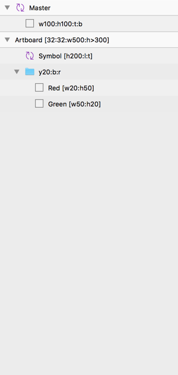

<!-- Description --> Plugin for handling layouts and sizing of layers automatically in Sketch based on the layer names. <!-- EOL --> I call it Pixel Perfect 👾!

## Install

Download the zip-file and double click on the `.sketchplugin` file to install.

## Example

Notice the naming of the layers to the left. Now select the artboard and execute `%L`. See the result of the script below.

<table>
  <tr></tr>
  <tr>
    <td><b>Layers</b></td>
    <td><b>Before</b></td>
  </tr>
  <tr>
    <td rowspan="3" valign="top"></td>
    <td></td>
  </tr>
  <tr>
    <td><b>After</b></td>
  </tr>
  <tr>
    <td></td>
  </tr>
</table>

## Usage

The script will go through all layers and sublayers to layout and size. It will also resize symbols to original size and even go inside the symbols themselves to make them pixel perfect too.

There are three ways to execute the script:
* `⌘L` with selection: only the selected layers and it's sublayers will be fixed.
* `⌘L` without selection: all layers and sublayers on the current page will be fixed.
* `^⌘L`: all layers and sublayers in the entire Sketch file will be fixed.

## Properties

By naming your layers with the formatting described below, your layers will take on certain properties depending on that name. These properties can be separated by `:` and can be contained, in the name, by putting them in brackets.

### `width`

#### Static

Set the layer width in pixels with `w` as the property index.

**Examples:** `w100`, `w20`

#### Addition or Subtraction

Add or subtract pixels to the width of the layer. This property works best together with a static width property or to add or subtract width to a symbol instance.

**Examples:** `w+100`, `w20:w-10`

#### Percentage

Set width relative the layer group width. If the layer group is also specified with a width percentage this will take into consider it's layer group width. If you specify two `%` the width will be set to the master or the artboard containing the layer independent of how many layer groups it's in.

**Examples:** `w100%`, `w50%%`

#### Min

Defined a minimum width in pixels for a layer group. If the sublayers within the group are less then the width it will increase the group size to the specified value, if greater than that it affects nothing.

**Examples:** `w>100`

### `height`

See `width`. Works exactly the same but with `h` as the property index.

**Examples:** `h100`, `h100:h+10`, `h100%`, `h>100`

### `padding`

Inspired by `Dynamic Button` and css, padding doesn't have a property index but instead solo numbers will be regarded as padding. Padding only works if it's together with a layer named `bg` (case-insensitive) which will be the layer affected by the padding. The numbers will be regarded in the order of `top`, `right`, `bottom` and `left`.

**Examples:** `32:24:32:24`, `32:24`, `w100:32:24`

### `margin`

Margin properties places the layer certain pixels off the sides relative it's layer group. The property indexes are; `t` for top, `r` for right, `b` for bottom, and `l` for left. If no number is specified it will be regarded as 0. If you want the layer to stretch all sides you can use the shorthand `trbl`.

**Examples:** `t:b:r30`, `b10:l10`, `tbrl`

### `stack-horizontally`

Stacks layers horizontally within a layer group. The order in the layer is the order they will be stacked. The property indexes are; `xt` for top aligned, `x` for center and `xb` for bottom aligned. The number following the index will account for the distance between the stacked objects.

**Examples:** `xt10`, `x-20`, `xb30`

### `stack-vertically`

See `stack-horizontally`. Works exactly the same but with `yl` for left aligned, `y` for center and `yr` for right aligned as the property index.

**Examples:** `yl10`, `y-20`, `yr30`

### `center-horizontally`

Centers the layer horizontally in it's layer group. Add a positive or negative number to offset it from it's center in pixels. `h` is the property index and can be used on it's own but if you want to apply offset you need to use `c` instead so to not confuse it with addition and subtraction of height.

**Examples:** `h`, `c-20`, `c30`

### `center-vertically`

See `center-horizontally`. Works exactly the same but with `v` as the property index.

**Examples:** `v`, `v-20`, `v30`

## Things to note

#### Symbol masters and Artboards

Symbol masters will resize itself to fit the content within, artboards will not. Artboards can have properties like, for instance, padding, and min width and min height.

#### Order of execution

The script goes from the bottom layer up and takes care of sublayers before applying properties to itself. Properties are applied from left to right except padding, which is always done last. Be aware of the ordering to get your expected behaviour.

#### Text layers

Will always be set to fixed size after resizing it to fit it's content.

#### Ignore

If you don't want the script to apply to a certain layer, add `[ignore]` to the name.

#### Constraints

Depending on the properties you have given a layer, constraints will be set as see fit. In short, margins and paddings will affect top, right, bottom, and left constraints while width and height will affect those constraints.
